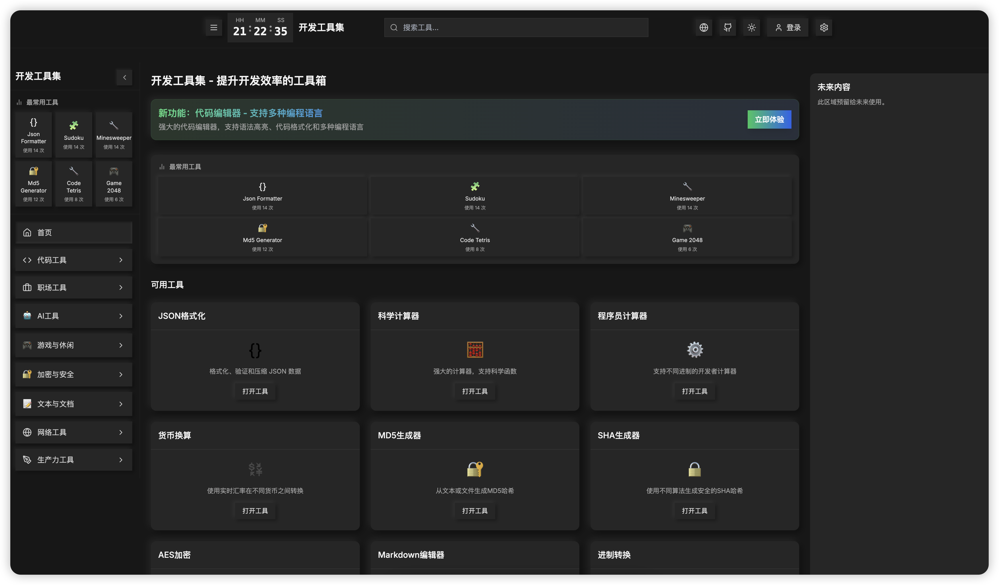

# 有趣的职场工具 (Fun Workplace Tools)

一个集合了各种实用且有趣的职场工具的网站，旨在提高工作效率、减轻工作压力，并为职场生活增添一些乐趣。



## 🌟 特色功能

- **辞职理由生成器**：当你需要一个专业且得体的辞职理由时
- **消息废话翻译官**：将企业术语转换为普通语言，反之亦然
- **拖延症竞技场**：将任务转化为怪物，通过完成任务来击败它们
- **代码编辑器**：基于 Monaco Editor 的强大在线代码编辑工具
- **正则表达式测试器**：测试和验证正则表达式
- **番茄钟**：帮助你专注工作并合理安排休息时间
- **呼吸练习**：缓解工作压力的简单呼吸练习
- **职场回怼话术**：应对职场尴尬情况的巧妙话术
- **摸鱼仪表盘**：追踪你的"摸鱼"时间（开玩笑的！）
- **多种实用计算工具**：包括计算器、程序员计算器、货币转换器等

## 📸 截图展示

### 辞职理由生成器


### 拖延症竞技场


### 代码编辑器


## 🛠️ 技术栈

- **前端框架**：Next.js 14 (React)
- **样式**：Tailwind CSS
- **UI 组件**：shadcn/ui
- **状态管理**：React Context API
- **3D 渲染**：Three.js (用于拖延症竞技场)
- **代码编辑器**：Monaco Editor
- **音效**：Howler.js
- **图标**：Lucide React

## 🚀 安装与使用

### 前提条件

- Node.js 18.x 或更高版本
- npm 或 yarn

### 安装步骤

1. 克隆仓库

```bash
git clone https://github.com/name718/swiss-dev.git
cd swiss-dev
```
